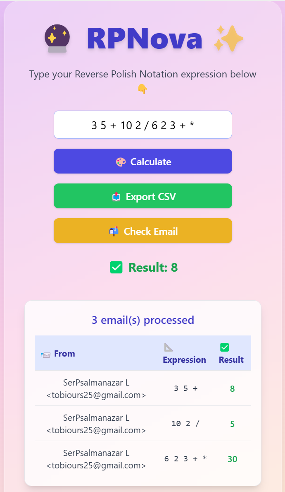

# 📬 RPNova: RPN  Calculator

A FastAPI-powered Reverse Polish Notation (RPN) calculator that computes math expressions from REST API calls, Gmail emails, or a vibey web UI. All operations are stored in PostgreSQL and can be exported to CSV. The app is containerized using Docker Compose for easy deployment.

---

---
## 🚀 Features

- 🧮 Evaluate RPN expressions via REST API (`POST /calculate`)
- 📧 Automatically check Gmail inbox for RPN expressions
- 📩 Parse multi-line expressions in email bodies
- 🗃️ Store operations and results in PostgreSQL
- 📤 Export all operations to CSV (`GET /export-csv`)
- 🌐 Web frontend built with Vite + React + TailwindCSS
- 🔮 Magic-themed UX with emoji-based feedback
- 🧪 Unit testing support for the core evaluator logic
- 🐳 Fully containerized with Docker Compose

---

## 🔧 How It Works

1. Send a math expression in **Reverse Polish Notation** via:
   - HTTP API (e.g., `3 4 + 2 *`)
   - Gmail email with subject `RPN` and one or more expressions in the body
   - Frontend web UI
2. FastAPI parses and evaluates the expression with a stack-based algorithm
3. Result is stored in PostgreSQL
4. You can export all results via a CSV file

---

## 💠 Setup & Usage

### 1. Clone the repo

```bash
git clone https://github.com/gelhteag/RPNova.git
cd RPNova
```

### 2. Add a `.env` file

```
EMAIL_ADDRESS=your_email@gmail.com
EMAIL_PASSWORD=your_gmail_app_password
DATABASE_URL=postgresql://postgres:postgres@db:5432/rpn_db
```

> ⚠️ If you're using 2FA, create a Gmail App Password from [https://myaccount.google.com/apppasswords](https://myaccount.google.com/apppasswords)

### 3. Run the project

```bash
docker-compose up --build
```

### 4. Use the calculator

- **Frontend UI** → open `http://localhost:5173`
- **API** → `POST http://localhost:8000/calculate`
  ```json
  { "expression": "5 1 2 + 4 * + 3 -" }
  ```
- **Gmail** → send an email to your address:
  ```
  Subject: RPN
  Body:
  3 5 +
  6 2 /
  7 8 + 3 *
  ```

### 5. Export results

- `GET http://localhost:8000/export-csv` → returns a downloadable CSV
- `GET http://localhost:8000/check-email` → manually triggers email parsing

---

## 📋 Example CSV Output

```
id,expression,result
1,3 5 +,8.0
2,6 2 /,3.0
3,7 8 + 3 *,45.0
4,3 4 + 2 *,14.0
```

---

## 🧪 Testing

Run unit tests for the RPN evaluator:

```bash
python -m unittest tests/test_rpn.py
```

You can also test the API using tools like Postman or HTTPie.

---

## 🎨 Frontend Preview

The UI is themed with Tailwind CSS and emojis — a clean glassy layout with fun feedback:

- 🔮 Custom favicon
- 🌈 Gradient background
- 🎨 Calculator-styled input
- ✅ Live response and result display

---

## 🧠 Plan for Managing a Python Dev Team on This Task

### Scenario: One Senior Software Engineer + ChatGPT

#### 1. 📌 Objective:

Deliver a modular, testable, and containerized FastAPI app that:

- Evaluates RPN expressions
- Offers HTTP + email input options
- Stores results in a database
- Exposes endpoints and a visual frontend
- Supports CI, testing, and Docker

#### 2. 👷 Roles:

- **Senior Engineer** → Architecture, backend, DB modeling, DevOps
- **ChatGPT** → Code generation, testing help, Docker optimization, polish

#### 3. 🗓️ Timeline: 2 Days

**Day 1: Backend API, DB, RPN evaluator, tests**

**Day 2: Frontend UI, Docker integration, CSV export, polish**

#### 4. 🛠 Tools

- FastAPI + Pydantic
- PostgreSQL + SQLAlchemy
- Docker + Compose
- Gmail IMAP
- React + Vite + TailwindCSS
- GitHub + ChatGPT + VSCode

---

## 📦 Tech Stack

- Python 3.11
- FastAPI
- PostgreSQL
- Docker + Compose
- IMAP (imaplib)
- React (Vite)
- Tailwind CSS
- Axios
- Pydantic
- dotenv

---

## 📄 License

MIT

---

> Created with 💡 by a dev and a friendly AI assistant 🤖

